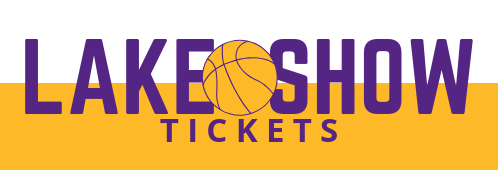
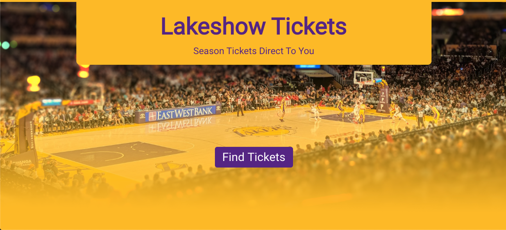
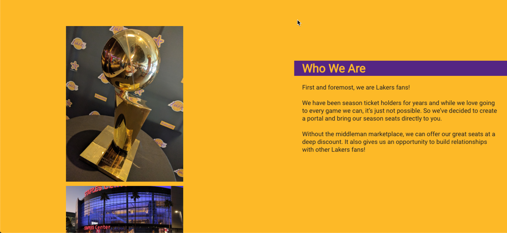
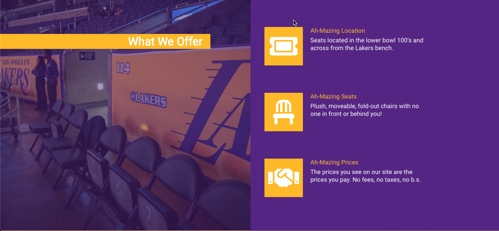
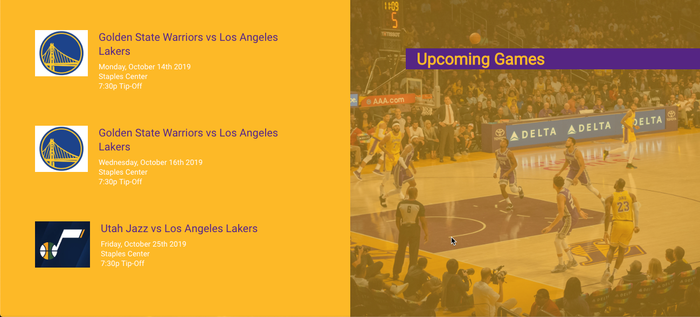
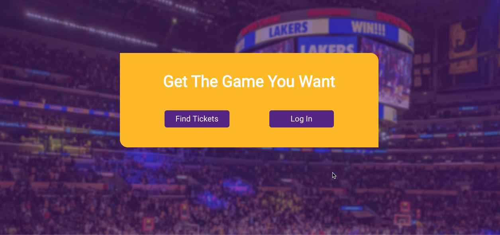
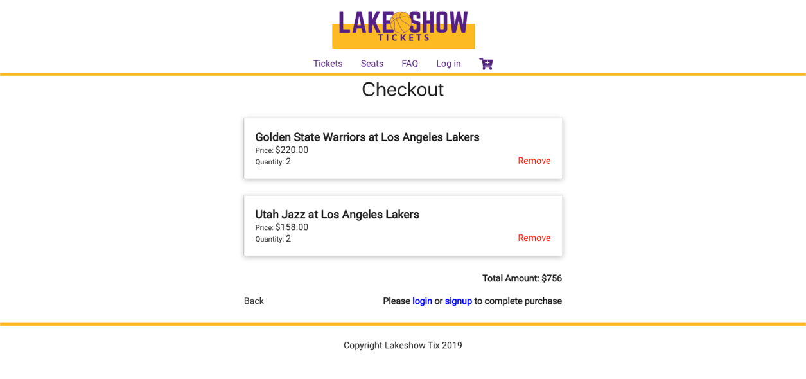
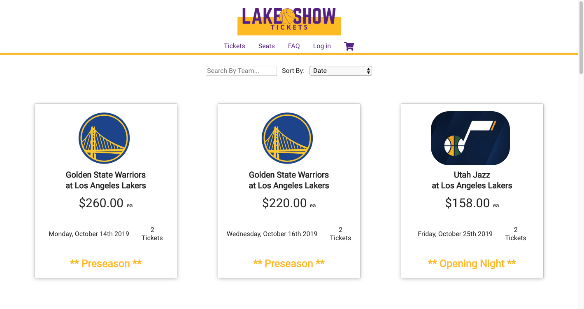
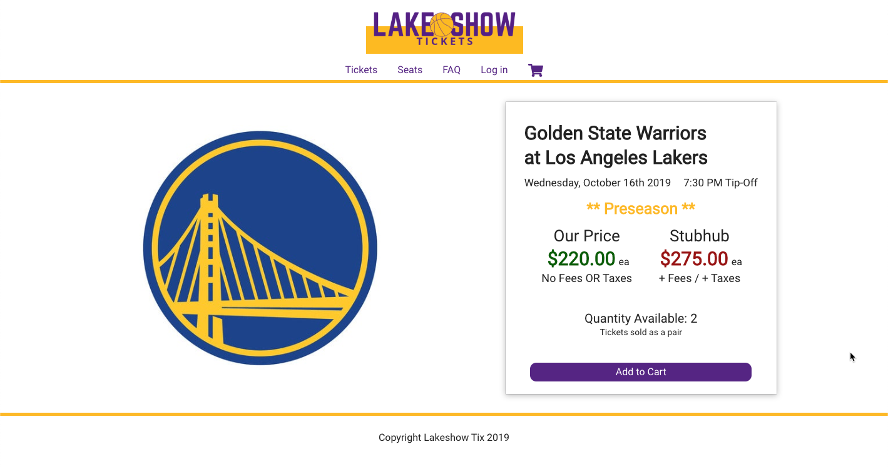

<p align="center">
  <a href="https://lakeshowtix.now.sh/">
    
  </a>
</p>

<p align="center">
  Lakeshow Tickets is a secondary market ticket portal to buy & sell LA Lakers season tickets without middle man markups.
</p>


<!-- START doctoc generated TOC please keep comment here to allow auto update -->
<!-- DON'T EDIT THIS SECTION, INSTEAD RE-RUN doctoc TO UPDATE -->
## Table of Contents

- [Introduction](#introduction)
- [Links](#links)
- [Demo Credentials](#demo-credentials)
- [Features](#features)
- [Screenshots](#screenshots)
- [Feedback](#feedback)
- [How To Use](#how-to-use)
- [Scripts](#scripts)
- [Technology](#technology)

<!-- END doctoc generated TOC please keep comment here to allow auto update -->
<hr>

## Introduction

With the rise of ticket fees for both sellers and buyers in the secondary marketplace for event tickets, this app was designed to connect Laker fans with Laker season ticket holders directly. Cutting out the middle man marketplace, by not charging buyers or sellers fees, the ticket prices are inherintely lower then any other other site the buyer chooses to post their tickets.
<hr>

## Links

#### Live App: https://lakeshowtix.now.sh/

Client Github Repo: https://github.com/matrayu/lakeshow-app

Server Github Repo: https://github.com/matrayu/lakeshow-server
<hr>

## Demo Credentials

##### Login U/N: kbryant
##### Login P/W: Tester12#

##### Paypal U/N: sb-muxzd184753@personal.example.com
##### Paypal P/W: <d5LB5dl

<hr>


## Features

A few of the things you can do with Lakeshow Tickets:

* Set up an account
* View all available tickets for the current NBA season 
* Search all available tickets by NBA Team 
* Sort all available ticket by Team, Date of Game or by Price 
* Purchase tickets directly using Paypal
<hr>

## Screenshots

<p align="center" >
  
  
  
  
  
  
  
  
  
</p>
<hr>

## Feedback

Feel free to send us feedback or [file an issue](https://github.com/matrayu/lakeshow-app/issues/new). Feature requests are always welcome. 
<hr>

## How To Use

To clone and run this application, you'll need [Git](https://git-scm.com) and [Node.js](https://nodejs.org/en/download/) (which comes with [npm](http://npmjs.com)) installed on your computer. From your command line:

```bash
# Clone this repository
$ git clone https://github.com/matrayu/lakeshow-app

# Go into the repository
$ cd lakeshow-app

# Install dependencies
$ npm install

# Run the app
$ npm start
```
<hr>

## Scripts

- `npm run dev` to start nodemon
- `npm t` to run tests
- `ndb start` to run debugging experience
<hr>

## Technology

- React
- HTML
- CSS
- Enzyme
- Jest
